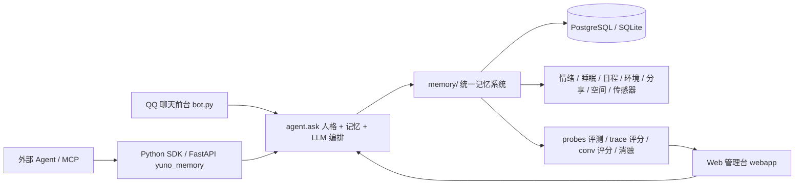
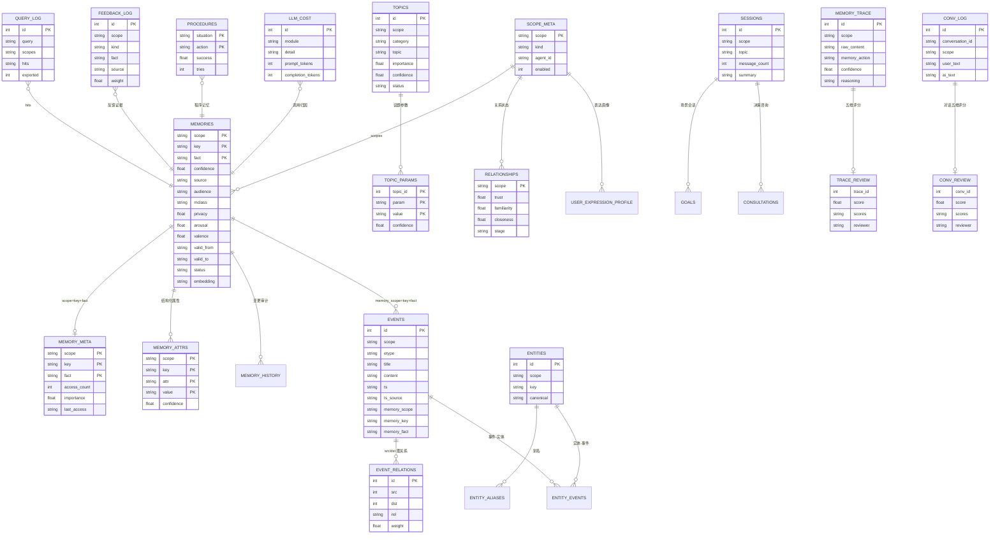

# Yuno 2.5 —— 成长型 Agent 记忆系统

Yuno 是一个把 **长期记忆、人格成长、关系建模、主动消息与可解释评测** 做成完整闭环的
Agent 记忆系统。它以 QQ 机器人为前台，同时提供 Python SDK、FastAPI 服务和 Web 管理台。

> 核心原则：**记忆不是聊天记录，而是可检索、可演化、可评分、可回滚的长期认知。**

---

## 1. 系统组成

| 组件 | 入口 | 说明 |
|---|---|---|
| QQ 前台 | `bot.py` | 人格对话、自动记忆、主动消息、游戏与指令 |
| 记忆核心 | `memory/` | 统一记忆、事件图谱、议题、情绪、睡眠、日程、空间、分享等 |
| Agent 编排 | `agent/` | `agent.ask` 串起分析、记忆检索、人格与 LLM 回复 |
| Python SDK | `yuno_memory/` | 任意 Agent 通过 `search / add / clear` 接入同一份记忆 |
| Web 管理台 | `webapp.py` | 评测、评分审核、消融、成本、诊断、数据与系统运维 |
| 运维工具 | `tools.py` | 健康检查、备份、评测、记忆治理、训练与导入导出 |

## 2. 架构总览



一条消息的完整旅程：

```text
用户消息
→ expression 网络语言与表达画像
→ analysis 意图 / 情绪 / 重要度 / 玩笑 / 纠错信号
→ controller 信息增益、Consent、时间推理、纠错调查
→ extract 两阶段提取（实体 / 属性 / 事实）
→ 写入 memories + 事件图 + 议题 + 索引 + 关系证据 + 处理轨迹
→ reasoning 七路融合检索 + RRF + 重排 + MMR
→ context 预算分级注入
→ LLM 生成回复
→ after_chat 反馈学习、对话记录、主动消息候选
→ grow / sleep 每日巩固、反思、遗忘与评测
```

## 3. 数据模型与 ER 图

生产环境默认使用 **PostgreSQL**；测试与轻量部署可切 SQLite。数据库不依赖物理外键，
关系由 `memory/` 层在事务内维护，索引表由 `memory-grow` 重建。



### 状态与索引 ER

以下状态表与派生索引由 `memory-grow`、生活/空间层和主动消息层维护：

```mermaid
erDiagram
    SPACE_STATE {
        int id PK
        string scope
        string position
        string updated_at
    }
    SPACE_EVENTS_STATE {
        int id PK
        string scope
        string event
        string ts
    }
    ITEM_EVENTS {
        int id PK
        string item
        string action
        string ts
    }
    ITEM_ACTIVATION_STATE {
        string item PK
        int activation
        string updated_at
    }
    ITEM_SEARCH_STATE {
        string scope PK
        string query
        int step
        string status
    }
    MIND_INTENTION_STATE {
        string scope PK
        string goal
        string intention
        string updated_at
    }
    HESITATION_LOG {
        int id PK
        string kind
        string action
        float delay_s
        string reason
    }
    NOTIFICATIONS {
        int id PK
        string target
        string content
        string scheduled_at
        string status
    }
    KV {
        string namespace PK
        string key PK
        string value
    }
    AUDIT {
        int id PK
        string action
        string target
        string detail
        string operator
    }
    BM25_TERMS {
        string term PK
        string scope PK
        string key PK
        string fact PK
    }
    BM25_DOCS {
        string scope PK
        string key PK
        string fact PK
    }
    VEC_INDEX {
        int id PK
        string scope
        string key
        string fact
    }
    VEC_CENTROIDS {
        int id PK
        string vector
    }
    VEC_PG {
        string scope PK
        string key PK
        string fact PK
    }
```



索引与状态派生表：

| 类别 | 表 |
|---|---|
| 词法索引 | `bm25_terms` / `bm25_docs` |
| 向量索引 | `vec_index` / `vec_centroids` / `vec_pg` |
| 生活与空间状态 | `space_state` / `space_events_state` / `item_activation_state` / `item_search_state` / `item_events` |
| 运行状态 | `kv` / `state` / `mind_intention_state` / `ai_actions_state` / `hesitation_log` / `notifications` |
| 审计与实验 | `audit` / `experiment_log` / `llm_cost` / `schema_migrations` |

## 4. 核心能力

### 记忆与检索

- **统一记忆表**：用户、AI 自身、人物档案同表同格式。
- **七路融合检索**：BM25 / FTS / 向量 / 事件图谱 / 结构化属性 / Rules / 议题，
  RRF 融合 + light/cross/LLM 三档重排 + MMR 去重。
- **按需路由**：根据查询类型动态调整算法权重，并记录各算法命中率。
- **贝叶斯置信度**：确认 / 反驳 / 冲突按似然比更新，稳定事实对噪声纠错有阻力。
- **分类遗忘**：core 永不过期，stable / preference / long / process / short 分级半衰期；
  稳定事实只降模糊、不硬删除。
- **自研 IVF 向量索引**：支持 nlist / nprobe 自动缩放与 `memory-index --tune` 网格调优。
- **中文专名与查询增强**：jieba 专名、指代消解、时间窗加权、短查询前文补全。

### 人格、情绪与生活世界

- **人设单一来源**：`personas/<pack>/persona.md`，经历沉淀为 `ai:experience`、巩固为 `ai:belief`。
- **多维情绪**：VAD + Plutchik + 议题 mood 质心，情绪调制遗忘与检索。
- **睡眠与梦境**：awake / standby / deep 三档，REM 生成梦境并可形成模糊记忆。
- **日程与环境**：种子化周计划、天气缓存与季节兜底、环境感知。
- **生活与空间**：房间-家具-容器物品系统、位置状态机、物品事件溯源、找东西分级搜索。
- **主动消息**：分享欲 + revive 泊松触发 + 贝叶斯用户状态，带冷却和疲劳约束。

### 认知与决策

- **心智状态中枢**：situation / emotion / goals / intention / activated_memories / options。
- **BDI 式目标**：目标强度 = 人设价值权重 × 优先级。
- **程序记忆**：situation → action → success，高成功率习惯可省一次 LLM 调用。
- **回应策略 bandit**：Thompson Sampling 学习“哪种哄法对当前用户有效”。
- **约定与原谅**：预约催办、同类错误计数、底线不妥协、关系驱动原谅概率。

### 质量闭环

- **记忆轨迹五维评分**：extraction / decision / confidence / provenance / privacy，
  评分驱动置信度因子、提取门槛与隐私阈值。
- **对话质量五维评分**：remember / natural / emotional / proactive / boundary，
  低分自动审计与归因，先诊断后调参。
- **评测基线**：memory / space / time / emotion / subjects / evidence-gate / policy-classify。
- **消融实验**：15 个机制开关热插拔，单变量关停后对比 recall / MRR / NDCG。
- **成本归因**：按天、按模块、按检索路径统计 token 与费用。

## 5. 快速开始

### 环境要求

- Python 3.10+
- PostgreSQL 14+（生产默认；不配置 PG 时可用 SQLite）
- DeepSeek 或其他 OpenAI 兼容 API Key

### 安装

```bash
cd qq-bot
python3 -m venv venv
./venv/bin/pip install -r requirements.txt
./venv/bin/pip install -r requirements-pg.txt   # 生产 PostgreSQL
cp .env.example .env
nano .env                                        # 填写机器人凭证与 API Key
./venv/bin/python scripts/pg_init_schema.py      # 初始化 PostgreSQL schema
./venv/bin/python tools.py config-validate
```

CPU 环境建议先安装 CPU 版 torch，避免 `install.sh` 拉取 CUDA 版：

```bash
./venv/bin/pip install torch -i https://pypi.tuna.tsinghua.edu.cn/simple -f https://mirrors.aliyun.com/pytorch-wheels/cpu
```

初始化 Persona Pack、向量索引与评测集：

```bash
./venv/bin/python tools.py init --pack yuno
```

启动服务：

```bash
./venv/bin/python bot.py                       # QQ Bot
./venv/bin/python webapp.py                    # Web 管理台，默认 127.0.0.1:8600
./venv/bin/python -m yuno_memory --port 8457   # SDK HTTP 服务
```

Web 地址：

- 管理台：`http://127.0.0.1:8600/`
- 公开状态页：`http://127.0.0.1:8600/public`

### 初始化记忆核心

`memory.core.enabled` 默认开启。首次部署建议执行：

```bash
./venv/bin/python tools.py memory-embed
./venv/bin/python tools.py memory-grow --dry-run
./venv/bin/python tools.py memory-sleep
```

## 6. 配置

### 环境变量（.env）

| 变量 | 说明 |
|---|---|
| `APPID` / `SECRET` | q.qq.com 机器人凭证 |
| `DEEPSEEK_API_KEY` / `DEEPSEEK_BASE_URL` / `DEEPSEEK_MODEL` | LLM 接入 |
| `ADMIN_OPENIDS` | 管理员 openid，逗号分隔 |
| `WEATHER_API_KEY` | 和风 / 高德天气；不填则季节种子模拟 |
| `EMBEDDING_API_KEY` | 云端 embedding（provider=openai_compatible 时） |
| `HF_HOME` / `HF_ENDPOINT` | HuggingFace 缓存与镜像 |
| `MEMORY_KEY` | 高隐私记忆 AES-GCM 密钥（可选） |
| `TIMEZONE` | 默认 `Asia/Shanghai` |
| `YUNO_DB_BACKEND` | `postgresql`（默认）或 `sqlite` |
| `YUNO_PG_HOST` / `PORT` / `DB` / `USER` / `PASSWORD` | PostgreSQL 连接参数 |
| `YUNO_PG_MINCONN` / `YUNO_PG_MAXCONN` | PG 连接池范围 |
| `YUNO_API_TOKEN` | SDK HTTP Bearer token |
| `YUNO_WEB_TOKEN` | Web 管理台 Bearer token |
| `YUNO_WEB_PASSWORD` / `YUNO_WEB_OPS_PASSWORD` / `YUNO_WEB_READONLY_PASSWORD` | 管理台三级密码 |

### config.json 关键段

| 段 | 说明 |
|---|---|
| `memory.core.enabled` | 记忆核心总开关 |
| `memory.core.weights` | 七路检索融合权重 |
| `memory.core.policy` | 遗忘、巩固、贝叶斯似然比 |
| `memory.core.emotion` | 情绪模型 |
| `memory.core.sleep` | 睡眠与梦境 |
| `memory.core.schedule` | 日程生成 |
| `memory.core.sharing` | 主动分享阈值与限频 |
| `memory.core.living` | 生活层与物品 |
| `memory.core.space` | 空间层与位置 |
| `memory.core.mind` | 心智状态、System 1、cognitive_turn |
| `memory.core.revive` | 主动消息泊松触发 |
| `memory.core.bandit` | 回应策略 Thompson Sampling |
| `memory.core.mood_boost` / `emotion_address` | 心境一致检索 |
| `personas/<pack>/world.json` | 房间图与队友排班 |

## 7. 常用指令

| 指令 | 说明 |
|---|---|
| `/目标 内容` / `/目标列表` / `/目标完成 内容` | 目标管理 |
| `/设定 角色名` | 生成人物档案，编辑后 `tools.py character-sync` 同步 |
| `/我的记忆` / `/群记忆` / `/我的风格` | 查看记忆与表达画像 |
| `/忘记 关键词` / `/公开 关键词` | 隐私控制 |
| `/绑定` / `/解绑` / `/昵称` | 身份绑定 |
| `/成语` / `/答题` / `/排名` | 游戏 |

## 8. SDK 与 HTTP 服务

```bash
python -m yuno_memory \
  --host 127.0.0.1 --port 8457 \
  --data-dir ./data \
  --api-key <DEEPSEEK_API_KEY> \
  --embedder local \
  --token <YUNO_API_TOKEN>
```

```python
from yuno_memory import Memory

mem = Memory()
mem.add_fact(scope="c2c:user1", key="cat", fact="养了一只叫煤球的橘猫", source="sdk")
print(mem.search("猫叫什么", scopes=["c2c:user1"]))
```

HTTP 接口：`/health`、`/memory/ingest`、`/memory/search`、`/memory/trace`、`/memory/review`、`/memory/eval`、`/memory/export`。
设置 token 后所有请求需带 `Authorization: Bearer <token>`；导出路径限制在 `data-dir` 内。

## 9. 测试、评测与运维

### 回归测试

```bash
make check                          # 配置校验 + diff 检查 + 全量 pytest
./venv/bin/python -m pytest -q      # 单元与冒烟测试
./venv/bin/python scripts/eval_ci.py      # CI 评测门禁，自动 baseline + 回归
./venv/bin/python scripts/secret_scan.py  # 密钥扫描
./venv/bin/python scripts/perf_ci.py      # 性能门禁
```

### 评测命令

```bash
./venv/bin/python tools.py memory-probes --limit 200     # 查询日志 → 评测集
./venv/bin/python tools.py memory-eval --file <probes> --save
./venv/bin/python tools.py space-eval --save
./venv/bin/python tools.py time-eval --save
./venv/bin/python tools.py emotion-eval
./venv/bin/python tools.py subjects-eval --save
./venv/bin/python tools.py evidence-gate-eval
./venv/bin/python tools.py policy-classify
./venv/bin/python tools.py ablation
./venv/bin/python tools.py consistency-eval
./venv/bin/python tools.py experiments
```

### 评分与训练

```bash
./venv/bin/python tools.py memory-trace-md --limit 20
./venv/bin/python tools.py memory-trace-review <id> --extraction 4 --decision 4
./venv/bin/python tools.py memory-conv-md --limit 20
./venv/bin/python tools.py memory-conv-review <id> --remember 4 --natural 4
./venv/bin/python tools.py memory-conv-report
./venv/bin/python tools.py emotion-log --days 14
./venv/bin/python tools.py emotion-train --file train.json
./venv/bin/python tools.py memory-calibrate --file <probes>
./venv/bin/python tools.py memory-index --tune --file <probes>
```

### 运维

```bash
./venv/bin/python tools.py health --notify
./venv/bin/python tools.py backup
./venv/bin/python tools.py recover
./venv/bin/python tools.py recover-drill
./venv/bin/python tools.py pg-guard --notify
./venv/bin/python tools.py memory-grow
./venv/bin/python tools.py memory-sleep
./venv/bin/python tools.py memory-consolidate
./venv/bin/python tools.py memory-governance
./venv/bin/python tools.py data-export
./venv/bin/python tools.py data-import <file>
```

## 10. 当前评测基线

> 基线会随评测集和参数迭代变化；CI 的自动基线见 `docs/baselines/ci_eval.json`。

| 指标 | 当前值 | 样本 |
|---|---:|---:|
| 证据门控 accuracy | 1.000 | 50 |
| 检索 recall@5 | 0.825 | 40 |
| 检索 MRR | 0.557 | 40 |
| 检索 NDCG | 0.623 | 40 |
| 空间 where_accuracy | 0.875 | 8 |
| 时间 window_recall | 0.900 | 10 |
| 时间 timeline_order | 0.612 | 299 |
| 情绪 accuracy | 0.918 | 61 |
| 情绪 VAD MAE | 0.143 | 61 |
| 多主体 privacy_rate | 1.000 | 4 |
| 轨迹评分 decision | 2.71 | 69 |
| 对话评分 proactive | 3.30 | 10 |

## 11. 文档索引

| 文档 | 内容 |
|---|---|
| [docs/deployment.md](docs/deployment.md) | 部署、systemd、备份与安全 |
| [docs/roadmap.md](docs/roadmap.md) | 路线图、待办与改进方向 |
| [memory/README.md](memory/README.md) | 记忆核心模块、算法与接口 |
| [agent/README.md](agent/README.md) | Agent / Persona 层 |
| [docs/评分清单-20260814.md](docs/评分清单-20260814.md) | 轨迹评分清单与批量评分说明 |

## 12. License

[LICENSE](LICENSE)
