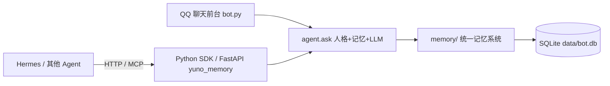

# YUNO AI 2.0 —— 成长型 Agent Memory System

> QQ 里聊天，App 里管理，MCP 串起所有能力。**记忆不是聊天记录，而是 AI 的长期认知。**

YUNO 2.0 是一个把 **AI 长期记忆 / 人格成长 / 关系系统 / 决策辅助** 做成完整认知闭环的 QQ 机器人，
同时把记忆系统抽成可独立接入任意 Agent 的 **Python SDK + FastAPI 服务**。



---

## 与 1.0 相比的变化

| 维度 | 1.x | 2.0 |
|---|---|---|
| 记忆 | 分场景简单事实列表 | 统一记忆认知系统：用户/AI/人物同表同格式，可信度演化、时间推理、遗忘巩固 |
| 检索 | 关键词 LIKE | 7 路融合检索（BM25/FTS/向量/图谱/结构化/Rules/议题）+ 重排 + MMR |
| 纠错 | 无 | 调查机制：不盲从，update/keep/uncertain 三选一，历史可回滚 |
| 人格 | 固定 prompt | 结构化人设字段（身份/性格/经历/动机）+ 核心不可变/自适应成长分层 |
| 关系 | 无 | AI-用户关系状态机（trust/familiarity/stage，行为证据驱动） |
| 决策 | 无 | 一次一问的真人式顾问（结合记忆、考虑现实约束、去模板化） |
| 管理 | 指令暴露在 QQ 聊天 | 管理迁出 QQ（App + MCP 能力层），QQ 只聊天 |
| 接入 | 只能 QQ | Python SDK + FastAPI，任意 Agent 可接入同一份记忆 |
| 工程化 | 无测试 | 32 套自动化测试、记忆轨迹导出、五维人工评分、评测基线闭环 |

## 功能一览

### QQ 端

- 人设对话（DeepSeek，慵懒毒舌角色千石由乃，自带心情与表达适配）
- 自动记忆：信息增益触发提取、玩笑/临时情绪/敏感信息过滤、纠错调查
- 决策顾问：`要不要/该不该/怎么选…` 触发一次一问的咨询流程
- 目标管理：`/目标`、`/目标列表`、`/目标完成`
- 人物设定：`/设定 <角色名>` 自动生成档案入记忆
- 游戏与播报：`/成语`、`/答题`、`/排名`、群动态播报
- 记忆指令：`/我的记忆`、`/群记忆`、`/忘记`、`/公开`、`/我的风格`

### 记忆系统（memory/）

统一记忆 + 7 路检索 + 贝叶斯可信度 + 时间推理 + 人脑式遗忘 + 议题化 + 事件图谱 +
自我反思 + 世界模型 + 表达理解 + 轨迹评分闭环。详见 [memory/README.md](memory/README.md)。

### SDK / HTTP（yuno_memory/）

任意 Python 程序或 Agent 接入同一套记忆。详见 [docs/SDK-使用.md](docs/SDK-使用.md)。

### MCP（tools.py mcp / hermes/）

服务管理、配置、审计、记忆读写、播报能力封装为 MCP 工具，供 Hermes 或管理 App 调用。

## 安装部署（Debian/Ubuntu 服务器）

### 前置条件

1. [q.qq.com](https://q.qq.com) 创建机器人，拿到 `AppID` / `AppSecret`。
2. [platform.deepseek.com](https://platform.deepseek.com) 创建 API Key。
3. Linux 服务器（示例路径 `/home/ubuntu/qq-bot`）。

### 步骤

```bash
# 1) 上传代码并进入目录
scp -r qq-bot-github ubuntu@<服务器IP>:~
mv ~/qq-bot-github ~/qq-bot && cd ~/qq-bot

# 2) 配置 .env（完整变量见 .env.example）
cp .env.example .env
nano .env    # 填 APPID / SECRET / DEEPSEEK_API_KEY / ADMIN_OPENIDS

# 3) 先装 CPU 版 torch（避免 install.sh 拉取 2.5GB CUDA 版）
python3 -m venv venv
./venv/bin/pip install torch -i https://pypi.tuna.tsinghua.edu.cn/simple -f https://mirrors.aliyun.com/pytorch-wheels/cpu
./venv/bin/python -c "import torch; print(torch.__version__)"   # 应带 +cpu

# 4) 一键安装（创建 aiagent 账号、systemd 服务、sudoers、日志轮转）
bash install.sh
```

### 启用记忆核心（config.json 默认关闭）

```bash
sudo python3 - <<'EOF'
import json
p = '/home/ubuntu/qq-bot/config.json'
c = json.load(open(p, encoding='utf-8'))
core = c['memory']['core']
core['enabled'] = True
core.setdefault('analysis', {}).update({'llm': True, 'min_interval_s': 300})
core.setdefault('world', {}).update({'enabled': True, 'budget_chars': 400, 'cache_ttl_s': 600, 'llm_investigate': True, 'investigate_throttle_s': 600})
core.setdefault('trace', {}).update({'enabled': True, 'retention_days': 7})
c.setdefault('chat_bridge', {}).update({'enabled': True, 'timeout_s': 2.5, 'min_interval_s': 90})
json.dump(c, open(p, 'w', encoding='utf-8'), ensure_ascii=False, indent=2)
print('config ok')
EOF

# 5) 补 .env 的模型下载配置
cat >> .env <<'EOF'
HF_HOME=/home/ubuntu/qq-bot/data/hf_cache
HF_ENDPOINT=https://hf-mirror.com
EOF

# 6) 启动并初始化
sudo systemctl restart qqbot
sudo -u aiagent ./venv/bin/python tools.py memory-embed
sudo -u aiagent ./venv/bin/python tools.py memory-grow --dry-run
```

### 配置管理员

私聊机器人发任意消息，然后：

```bash
sudo grep "\[引导\]" /home/ubuntu/qq-bot/data/bot.log | tail -1
```

把返回的 `user_openid` 填入 `.env` 的 `ADMIN_OPENIDS=`，重启生效。

### 定时维护（备份 + 每日成长）

```bash
printf '0 3 * * * cd /home/ubuntu/qq-bot && ./venv/bin/python tools.py backup >> data/cron.log 2>&1\n30 3 * * * cd /home/ubuntu/qq-bot && ./venv/bin/python tools.py memory-grow >> data/cron.log 2>&1\n' | sudo -u aiagent crontab -
```

## 配置说明

### .env（密钥与运行设置）

| 变量 | 说明 |
|---|---|
| `APPID` / `SECRET` | q.qq.com 机器人凭证 |
| `DEEPSEEK_API_KEY` / `DEEPSEEK_BASE_URL` / `DEEPSEEK_MODEL` | DeepSeek 接入 |
| `SYSTEM_PROMPT` | 覆盖 persona.md 的人设（一般不填） |
| `ADMIN_OPENIDS` | 管理员 openid（逗号分隔） |
| `EMBEDDING_API_KEY` | 云端 embedding API 密钥（provider=openai_compatible 时） |
| `HF_HOME` / `HF_ENDPOINT` | 模型下载目录 / 国内镜像 |
| `AGENT_ID` | 多 Agent 人格命名空间（可选） |
| `MEMORY_KEY` | 高隐私记忆 AES-GCM 加密密钥（可选） |
| `CONFIG_PATH` / `QQBOT_CONFIG` | 覆盖配置路径（可选） |

### config.json（关键段）

| 段 | 说明 |
|---|---|
| `memory.core.enabled` | 记忆核心总开关（必须 true） |
| `memory.core.weights` | 7 路检索融合权重 |
| `memory.core.policy` | 遗忘/巩固/贝叶斯似然比参数 |
| `memory.core.analysis` | 情绪 LLM 兜底开关与节流 |
| `memory.core.world` | 用户中心世界模型（预算/调查开关） |
| `memory.core.trace` | 记忆轨迹记录与保留期 |
| `chat_bridge` | 慢响应衔接语开关 |
| `services` | MCP 服务注册表（管理 App / Hermes 用） |

## 常用指令

| 指令 | 说明 |
|---|---|
| 直接聊天 | 人设对话（带记忆、心情、表达适配） |
| `/帮助` | 指令菜单 |
| `/目标 内容` / `/目标列表` / `/目标完成 内容` | 目标管理 |
| `/设定 角色名` | 生成人物档案入记忆 |
| `/我的记忆` / `/群记忆` / `/我的风格` | 查看记忆 / 表达画像 |
| `/忘记 关键词` / `/公开 关键词` | 隐私控制 |
| `/绑定` / `/解绑` / `/昵称 名字` | 身份 |
| `/成语` / `/答题` / `/排名` | 游戏 |

## SDK 与 HTTP 服务

```bash
python -m yuno_memory --host 127.0.0.1 --port 8457 --data-dir ./data --api-key <key> --embedder local
```

详见 [docs/SDK-使用.md](docs/SDK-使用.md)。

## 测试与维护

```bash
sudo -u aiagent ./venv/bin/python tools.py memory-governance   # 记忆治理报告
sudo -u aiagent ./venv/bin/python tools.py memory-trace-md --limit 20  # 记忆轨迹
sudo -u aiagent ./venv/bin/python tools.py data-export         # 全量数据打包
sudo -u aiagent ./venv/bin/python tools.py memory-trace-review <id> --extraction 5 --decision 4  # 人工评分
```

自动化测试与评测闭环见 [docs/Agent-OS-v6-系统测试报告.md](docs/Agent-OS-v6-系统测试报告.md)。

## 文档索引

| 文档 | 内容 |
|---|---|
| [memory/README.md](memory/README.md) | 记忆系统框架、算法、设计决策、瓶颈 |
| [docs/Agent-OS-v6-架构评审.md](docs/Agent-OS-v6-架构评审.md) | 第三方架构评审 |
| [docs/Agent-OS-v6-系统测试报告.md](docs/Agent-OS-v6-系统测试报告.md) | 16 项能力测试报告 |
| [docs/ML-训练路线.md](docs/ML-训练路线.md) | 机器学习训练路线（v11→v17） |
| [docs/SDK-使用.md](docs/SDK-使用.md) | SDK / HTTP 接入指南 |
| [docs/详细设计.md](docs/详细设计.md) | 2.0 管理 App 需求设计 |

## 未来方向

- 跑真实数据建立评测基线：权重网格搜索、置信度回归、LTR 排序、提取门控（服务器 CPU 可训）
- 2060S 微调 embedding / reranker
- Bandit 在线调权（带评测门防漂移）
- 记忆系统 SDK 化已完成，下一步接入 Hermes 与多平台

详见 [docs/ML-训练路线.md](docs/ML-训练路线.md)。

## License

[LICENSE](LICENSE)
