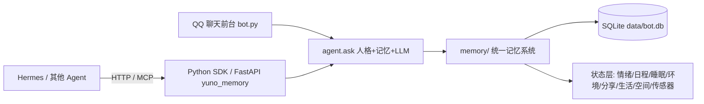

# YUNO AI 2.2 —— 成长型 Agent Memory System

> QQ 里聊天，App 里管理，MCP 串起所有能力。**记忆不是聊天记录，而是 AI 的长期认知。**

YUNO 2.2 是一个把 **AI 长期记忆 / 人格成长 / 关系系统 / 决策辅助 / 生活化世界层** 做成完整认知闭环的 QQ 机器人，
同时把记忆系统抽成可独立接入任意 Agent 的 **Python SDK + FastAPI 服务**。

当前版本：**v2.2**（在 2.0/2.1 仓库基础上迭代；功能基线 v31/v32——记忆检索重排 + 多维情绪 +
睡眠/日程/环境/分享/生活/空间/传感器世界层 + 认知层）。

v2.2 相对 v2.1 的主要变化：新增心智状态中枢 / 目标意图（BDI）/ 程序记忆（System 1/2）/
单次结构化输出等认知层；物品位置历史（事件溯源）+ 激活分级找东西（静默搜索、话题暂停、
重问续搜）；家内房间图与真实移动；空间事件进统一记忆检索（location 过滤）；队友确定性位置；
空间评测探针与基线对比；运行计数器（tick/err）与裸 except 审计；kv 状态迁正规表；
pytest 回归套件 + CI；日程夜晚槽合理化（22–02 在家夜生活、02–06 睡觉）与分享消息的时间/天气一致性。



---

## 与 1.0 相比的变化

| 维度 | 1.x | 2.0 |
|---|---|---|
| 记忆 | 分场景简单事实列表 | 统一记忆认知系统：用户/AI/人物同表同格式，可信度演化、时间推理、遗忘巩固 |
| 检索 | 关键词 LIKE | 7 路融合检索（BM25/FTS/向量/图谱/结构化/Rules/议题）+ RRF 重排 + MMR |
| 纠错 | 无 | 调查机制：不盲从，update/keep/uncertain 三选一，历史可回滚 |
| 人格 | 固定 prompt | 结构化人设字段（身份/性格/经历/动机）+ persona.md 单一来源 + AI 人格记忆成长分层 |
| 关系 | 无 | AI-用户关系状态机（trust/familiarity/stage，行为证据驱动） |
| 决策 | 无 | 一次一问的真人式顾问（结合记忆、考虑现实约束、去模板化） |
| 世界层 | 无 | 情绪/睡眠/日程/天气/环境/分享欲/生活/空间/传感器——AI 有自己的生活节奏与作息 |
| 管理 | 指令暴露在 QQ 聊天 | 管理迁出 QQ（MCP 能力层 + Hermes；App 见详细设计），QQ 只聊天 |
| 接入 | 只能 QQ | Python SDK + FastAPI，任意 Agent 可接入同一份记忆 |
| 工程化 | 无测试 | e2e / 负载 / 专项验收测试、记忆轨迹、五维人工评分、评测基线闭环 |

## 功能一览

### QQ 端

- 人设对话（DeepSeek，慵懒毒舌角色千石由乃，自带心情、情绪状态与表达适配；人设单一来源 persona.md）
- 自动记忆：信息增益触发提取、玩笑/临时情绪/敏感信息过滤、纠错调查
- 决策顾问：`要不要/该不该/怎么选…` 触发一次一问的咨询流程
- 目标管理：`/目标`、`/目标列表`、`/目标完成`
- 人物设定：`/设定 <角色名>` 自动生成档案入记忆，并双写 `docs/characters/<名>.md`
  供人工审阅/编辑，`tools.py character-sync <名>` 一键同步回记忆库（md 为权威来源）
- 约定记忆（v23）：聊到「明天下午3点见」自动记录，到点你没出现会主动催你（带情绪，最多两次）
- 错误与原谅（v23）：同类错误计数、生气度随时间衰减；涉及底线的事不道歉不松口，道歉后按关系好坏决定原谅概率
- 生活化世界层（v31/v32）：AI 有自己的日程与作息、天气与环境感知、睡眠模式（省电/深睡）、
  分享欲（主动发消息有分寸）、动态距离感、跨房间查看、生日与年龄
- 游戏与播报：`/成语`、`/答题`、`/排名`、群动态播报
- 记忆指令：`/我的记忆`、`/群记忆`、`/忘记`、`/公开`、`/我的风格`

### 记忆系统（memory/）

统一记忆 + 7 路检索 + 贝叶斯可信度 + 时间推理 + 人脑式遗忘 + 议题化 + 事件图谱 +
自我反思 + 世界模型 + 表达理解 + 多维情绪（VAD + Plutchik）+ 轨迹评分闭环。
详见 [memory/README.md](memory/README.md)。

### SDK / HTTP（yuno_memory/）

任意 Python 程序或 Agent 接入同一套记忆：pip 可安装包 + FastAPI 服务 + 统一
`memory.search / add / clear` 接口，供 Hermes 等外部 Agent 读写同一份记忆库。

### MCP（tools.py mcp / hermes/）

服务管理、配置、审计、记忆读写、播报能力封装为 MCP 工具，供 Hermes 或管理 App 调用；
人设经 `tools.py sync-persona` 同步为 Hermes 的 SOUL.md，两端共享同一份长期记忆与人格来源。
详见 [hermes/README.md](hermes/README.md)。

## 新增功能介绍

### v2.2 迭代重点

- **认知层**：心智状态中枢（situation/情绪/目标/意图/命中的记忆/候选动作统一快照）、
  目标强度 = 人设价值权重 × 优先级、BDI 式当前意图、程序记忆（情境→动作→成功率，
  System 1 命中直接复用省一次 LLM 调用）、单次结构化输出（`mind.cognitive_turn`，JSON
  解析失败自动回退普通路径）、人设价值函数化（`persona_weights`）。
- **空间与物品**：物品事件溯源 + `position_at`；"X 在哪"按激活值分级（直接答/模糊答/逐处搜索），
  静默搜索只报结果、话题转移自动暂停、重问续搜不重启；家内房间图（邻接/门/灯）与真实移动；
  空间事件写 `ai:episodic`（BM25 + 向量即时索引，检索支持 location 过滤）；队友确定性周表；
  `tools.py space-eval --save/--compare` 评测与基线对比。
- **工程化**：六个 kv 状态迁正规表（space_state / item_activation / item_search /
  mind_intention / space_events / ai_actions，旧数据自动迁移）；内存缓冲运行计数器
  （tick 各模块运行次数 / err 异常审计 / LLM 调用统计）；`tools.py mind-status` /
  `procedures-list` / `living-bootstrap`；pytest 回归套件 + GitHub Actions CI；v29 路径参数化。
- **行为一致性**：搜索停摆 bug 修复；日程夜晚槽只在家（22–02 夜生活、02–06 睡觉，
  旧的不合理周计划自动重生成）；主动分享消息的时间/天气硬约束（素材没有就不许提）；
  `repair_spatial` 扩展（数量/状态一致性、同名多容器、容量检查）。
- **代码审计**：246 处裸 except 全部换成 `err:<模块>` 计数 + 日志，异常可观测、可消融。

### 记忆与检索（v31）

- **7 路融合检索**：词法 BM25 / FTS / 向量 / 事件图谱 / 结构化属性 / Rules / 议题，
  RRF 融合（权重可配）+ MMR 多样性去重；检索顺序改为**相关度优先**，
  policy（重要度/时效）与置信度只做乘性微调，不再挤掉真正相关的记忆。
- **按需路由 + 自适应**：按查询类型（属性/时间/短查询）动态调整各算法权重，
  并记录每种算法的历史命中率自动微调（`route_stats`，即"学出来的按需调用"）。
- **重排三档**：`light`（子串 + 词元覆盖 + 议题一致性，默认）→ `cross`（本地 CrossEncoder）→
  `llm`（DeepSeek），失败自动降级。
- **软过滤与分数分解**：低分记忆不硬剔除、降权保留；检索结果可输出
  rrf / policy / confidence 分数来源分解（`tools.py memory-route` 诊断用）。
- **按类别遗忘半衰期**：core 永不过期、stable ≈720 天、preference ≈360 天、long ≈240 天、
  process ≈120 天、short ≈60 天；稳定事实与偏好只降模糊不硬删（conf=0.25）。
- **自研 IVF 向量索引**：kmeans 质心 + nprobe 探测，`nlist/nprobe=0` 时按记忆量自动缩放
  （`tools.py memory-index --tune` 可网格调优）。
- **中文专名检测**：jieba 词性 + 姓氏正则（"林晓""小白"），修复中文专名漏召回。
- **查询增强**：时间窗加权（"最近"降旧记忆）、活跃目标注意力、议题打包注入、
  指代消解与同义扩展。

### 情绪系统（memory/emotion.py，v31）

- **多维情绪模型**：Russell 环形（效价/唤醒）+ VAD（加支配度 3D）+ Plutchik 8 类情绪 × 强度档。
- **AI 情绪状态机**：人设基线 + 消息事件增量 + 指数衰减（默认 90 分钟），kv 持久化重启不丢；
  被冒犯会冷淡回击、被夸会别扭开心，情绪直接影响语气与行为。
- **用户情绪估计**：滚动窗口 + 效价趋势，"连续失败后该耐心"这类历史融合只影响语气；
  情绪归因块区分"我的情绪"和"用户的情绪"，避免穿帮。
- 配置：`memory.core.emotion`（baseline / decay_minutes / user_window）。

### 睡眠与梦境（memory/sleep.py，v31）

- **三档作息**：`awake` 正常 / `standby` 省电待机（被消息唤醒 = 从省电里捞出来，半醒分层回应）/
  `deep` 深睡（默认 02:00–05:00 真离线，消息进未读队列，醒来自然带一句"你昨晚找我了？"）。
- **紧急唤醒**：连续 2 条紧急消息触发系统级唤醒；被打断次数记入"今日回忆"（"昨晚被吵醒 N 次"）。
- **梦境（REM）**：DeepSeek 生成梦（类型/内容随机，防 AI 味词过滤），梦大概率忘记，
  小概率留模糊 `dream` 记忆（1.5 天半衰期），清晨主动提一次。
- 配置：`memory.core.sleep`（deep_window / emergency_threshold / dream_remember_prob）。

### 日程、天气与环境感知（memory/schedule.py + environment.py，v31）

- **日程**：`profile=yuno`（夜行、排练/演出/宅家）或 `office`（上班族），种子化周计划——
  同一周稳定、跨周变化，演出前合练/演出后恢复等状态链；夜晚槽（22:00–06:00）只会安排
  在家活动且 22:00–02:00 为夜生活、02:00–06:00 强制睡觉（对齐"凌晨 2 点后才睡"人设
  与深睡档），旧的不合理周计划会自动重生成；用户约定优先于默认日程。
- **天气**：和风/高德直连（`WEATHER_API_KEY`，2026 起支持专属 API Host），30 分钟缓存，
  失败自动回退"按季节 + 当日种子"的模拟天气。
- **环境感知**：日程 → 地点 → 周围人物（`cast` 队友名单，排练/演出/偶遇时具名出现）→
  天气/光照；途中状态 + 信号较弱提示，`can_see` 同房间 + 光线双重判定。
- 配置：`memory.core.schedule` / `weather` / `environment`。

### 分享欲（memory/sharing.py，v31）

- **主动发消息**：事件增量（演出/作曲/梦/被夸）× 情绪 VAD 加成 × 关系门槛 × 疲劳修正，
  指数衰减（半衰期 8 小时），LLM 生成人设消息走通知队列主动发给用户。
- **有分寸**：冷却 3 小时、日上限 2 条、周上限 8 条、演出/睡觉时段静默；
  用户嫌烦有分级惩罚（0.75/0.5/0.4）、正向反馈可提前解除，用户低落时不晒。
- 配置：`memory.core.sharing`（threshold / cooldown_hours / max_per_day / max_per_week）。

### 生活层、空间层与传感器（living.py + space.py + sensors.py，v31/v32）

- **家的布局**：房间 → 家具 → 容器，物品懒展开（箱子里有什么查询时才注入）；
  `take / give / move` 数量增减与容量限制，联动分享欲。
- **world_delta（v32）**：用户一句话改变世界（"我把你牛奶喝了一半"）→ 关键词预筛 →
  LLM 输出结构化 JSON → 引擎校验后应用，60 秒节流，绝不直接改状态。
- **动态距离**：基准分钟 × 交通方式 × 天气 × 懒散系数（yuno 1.15）× 情绪 × 当日种子。
- **空间层**：位置状态机（在场/在途中，出发窗口 = 槽位开始 − 路程，自动出发/到达）、
  场所拓扑（pair_times 可配）、事件流；行为记忆流（去过哪/做了什么只追加可注入，防穿帮）。
- **传感器（v32）**：家庭设备（门铃/灯/冰箱/空调/电视…）状态 + 事件驱动传播；
  `named_block` 支持跨房间点名查询（"客厅灯开着吗"）。
- **物品位置历史与模糊找东西（P0-1/P0-3）**：物品事件溯源（move/give/see/lost… 落表），
  "X 在哪"按激活值分级——直接答 / 模糊答 / 触发逐处搜索（静默推进只报结果；
  话题转移自动暂停、重问续搜不重启；难度影响命中，彻底失败按概率标记"真丢了"）。
- **家内房间图与真实移动（P1-1）**：房间邻接/门/灯状态，"跨房间看看"从定时器改为
  沿房间图真实走过去（出发/到达进事件流与行为记忆）；`can_see` 支持邻接 + 门开 + 灯亮。
- **人设→场景生成（P1-2）**：`tools.py living-bootstrap` 按 persona 生成家里该有的物品，
  只新增不覆盖，并写 origin（"为什么有这个东西"的依据）。
- **队友确定性位置（P2）**：cast 周表（`space.cast_schedule`），"谁在哪"有据可依，
  替代随机人物桶。
- **空间评测（P2）**：`tools.py space-eval`——X 在哪命中率 / 某时刻召回 / 找东西模拟
  （平均步数与失败率），调遗忘/搜索参数先看这些数字。
- **生日/年龄**：临近生日暗示（熟悉度达标）、祝贺反应、一年一长。
- 配置：`memory.core.living` / `space` / `interaction`。

### 对话与人格（v23/v29/v31）

- **约定管理（appointment）**：识别「明天下午3点见」自动记录（按用户时区），
  到点 + 宽限期后没出现会主动催（最多 2 次、情绪递增）；待履约约定注入上下文。
- **错误与原谅（mistake）**：同类错误计数，生气度 = 次数封顶 3 × 0.5^(天/7)；
  底线类不道歉松口概率为 0，道歉后按关系分/信任/熟悉度计算原谅概率。
- **人物设定（character）**：`/设定 角色名` 生成档案入记忆并双写
  `docs/characters/<名>.md`，`tools.py character-sync` 一键同步回（md 为权威来源）。
- **人设单一来源**：`persona.md` → QQ 直接读、`tools.py sync-persona` 同步 Hermes SOUL.md；
  AI 自身对话经历按重要度沉淀为 experience、每日巩固成 belief，人格随经历缓慢成长。
- **会话结构**：时间窗口 + 同主题续接（sessions），跨天同主题自然衔接。
- **对话质量**：自动消息自洽带前因、设备问题意图推测、反重复句式（同一梗一天最多一次）、
  跨房间"我去看看"延迟自然汇报（20~45 秒）。

### 认知层（mind / procedures）

- **心智状态中枢**：情境解读（威胁/机会/无关）/ 情绪 / 激活目标 / 当前意图 /
  命中的记忆 / 候选动作（效用分）统一成结构化快照注入；`tools.py mind-status` 可诊断。
- **目标与意图（BDI 式承诺）**：目标强度 = 人设价值权重 × 优先级（`persona_weights` 可配），
  最高强度激活目标成为当前 intention，持续到完成或放弃；appointment/schedule/living 都是目标源。
- **程序记忆（System 1/2）**：情境 → 动作 → 成功率 落表，用户 praise/纠正自动学习；
  命中高成功率习惯直接复用回复（省一次 LLM 调用），没命中才走深思。
- **单次结构化输出（可选）**：`mind.cognitive_turn=true` 时把 appraisal/goals/intention/
  action/reply 压进一次 LLM 调用（JSON），解析失败自动回退普通路径——延迟成本几乎不变，
  但拿到决策的可解释结构。
- **人设价值函数化**：persona 关键词 → 权重参与效用计算，人设从"描述"变"决策参数"。

### 工程与运维（v10~v32）

- **记忆轨迹 + 五维评分闭环**：每次处理记录轨迹（create/merge/update/decay/reject…），
  人工按 extraction/decision/confidence/provenance/privacy 五维评分，
  评分均值直接驱动 confidence_factor / 提取门槛 / 隐私阈值（"评分 → 行为"闭环）。
- **隐私与加密**：规则检测（手机号/证件/财务/健康…），可选 AES-GCM 加密（`MEMORY_KEY`）；
  私聊记忆不进群、`/忘记` `/公开` 控制可见性。
- **纠错调查与时间推理**：用户否定先调查再决定 update/keep/uncertain（不盲从），
  历史可回滚；"转/换/改用/戒"等状态变化自动 supersede 旧记忆。
- **提取污染防护（v29）**：用户记忆不混入"机器人…"开头的 AI 自述。
- **测试**：`e2e_test.py`（生活回流/礼物隐私/嫌烦惩罚/久别重逢/话题锚点/情绪归因）、
  `load_test.py`（并发负载）、`v29_test.py`（污染专项验收）。
- **运维命令**：`health` / `backup` / `recover` / `config-validate` / `data-export` / `data-import` /
  `emotion-eval` / `emotion-log` / `memory-index --tune` / `memory-calibrate` 等。

## 安装部署（Debian/Ubuntu 服务器）

### 前置条件

1. [q.qq.com](https://q.qq.com) 创建机器人，拿到 `AppID` / `AppSecret`。
2. [platform.deepseek.com](https://platform.deepseek.com) 创建 API Key。
3. （可选）[和风天气](https://dev.qweather.com) 注册 key 填 `WEATHER_API_KEY`，
   不配置时环境感知自动回退到按季节种子的模拟天气。
4. Linux 服务器（示例路径 `/home/ubuntu/qq-bot`）。

### 步骤

```bash
# 1) 上传代码并进入目录
scp -r qq-bot-github ubuntu@<服务器IP>:~
mv ~/qq-bot-github ~/qq-bot && cd ~/qq-bot

# 2) 配置 .env（完整变量见 .env.example）
cp .env.example .env
nano .env    # 填 APPID / SECRET / DEEPSEEK_API_KEY / ADMIN_OPENIDS

# 3) 先装 CPU 版 torch（避免 install.sh 拉取 2.5GB CUDA 版）
python3 -m venv venv
./venv/bin/pip install torch -i https://pypi.tuna.tsinghua.edu.cn/simple -f https://mirrors.aliyun.com/pytorch-wheels/cpu
./venv/bin/python -c "import torch; print(torch.__version__)"   # 应带 +cpu

# 4) 一键安装（创建 aiagent 账号、systemd 服务、sudoers、日志轮转）
bash install.sh
```

### 初始化记忆核心

`memory.core.enabled` 自 v31 起默认 `true`（长期记忆检索 + 状态类模块），无需手动开启；
改过配置可先跑 `tools.py config-validate` 校验。启动后初始化一次：

```bash
sudo systemctl restart qqbot
sudo -u aiagent ./venv/bin/python tools.py memory-embed    # 为缺少向量的记忆回填 embedding
sudo -u aiagent ./venv/bin/python tools.py memory-grow --dry-run
sudo -u aiagent ./venv/bin/python tools.py memory-sleep    # 浅睡/深睡巩固 + REM 做梦
```

### 配置管理员

私聊机器人发任意消息，然后：

```bash
sudo grep "\[引导\]" /home/ubuntu/qq-bot/data/bot.log | tail -1
```

把返回的 `user_openid` 填入 `.env` 的 `ADMIN_OPENIDS=`，重启生效。

### 定时维护（备份 + 每日成长）

```bash
printf '0 3 * * * cd /home/ubuntu/qq-bot && ./venv/bin/python tools.py backup >> data/cron.log 2>&1\n30 3 * * * cd /home/ubuntu/qq-bot && ./venv/bin/python tools.py memory-grow >> data/cron.log 2>&1\n' | sudo -u aiagent crontab -
```

## 配置说明

### .env（密钥与运行设置）

| 变量 | 说明 |
|---|---|
| `APPID` / `SECRET` | q.qq.com 机器人凭证 |
| `DEEPSEEK_API_KEY` / `DEEPSEEK_BASE_URL` / `DEEPSEEK_MODEL` | DeepSeek 接入 |
| `SYSTEM_PROMPT` | 覆盖 persona.md 的人设（一般不填，默认 persona.md 单一来源） |
| `ADMIN_OPENIDS` | 管理员 openid（逗号分隔） |
| `WEATHER_API_KEY` | 和风/高德天气 key（不填则环境感知用模拟天气兜底） |
| `EMBEDDING_API_KEY` | 云端 embedding API 密钥（provider=openai_compatible 时） |
| `HF_HOME` / `HF_ENDPOINT` | 模型下载目录 / 国内镜像 |
| `AGENT_ID` | 多 Agent 人格命名空间（可选） |
| `MEMORY_KEY` | 高隐私记忆 AES-GCM 加密密钥（可选） |
| `CONFIG_PATH` / `QQBOT_CONFIG` | 覆盖配置路径（可选） |
| `TIMEZONE` | 默认 Asia/Shanghai；用户声明所在地时会自动记住并切换 |

### config.json（关键段）

| 段 | 说明 |
|---|---|
| `memory.core.enabled` | 记忆核心总开关（v31 起默认 true；关闭则长期记忆检索停用，状态类模块不受影响） |
| `memory.core.weights` | 7 路检索融合权重 |
| `memory.core.policy` | 遗忘/巩固/贝叶斯似然比参数（按类别半衰期） |
| `memory.core.emotion` | 多维情绪模型（VAD 基线/衰减/用户窗口） |
| `memory.core.sleep` | 睡眠与梦境（深睡窗口、紧急唤醒、梦保留概率） |
| `memory.core.schedule` | AI 日程（profile: yuno / office 周计划生成） |
| `memory.core.weather` | 天气提供方（和风/高德、专属 API Host、位置） |
| `memory.core.environment` | 环境感知（快照缓存、具名队友 cast） |
| `memory.core.sharing` | 分享欲（阈值、冷却、日/周上限） |
| `memory.core.living` | 生活层（家布局、懒散系数、生日、搜索/激活参数、人设→场景生成 bootstrap） |
| `memory.core.space` | 空间层（家内房间图/门灯、场所拓扑、队友确定性周表 cast_schedule） |
| `memory.core.interaction` | 互动调节器（场景/关系/用户状态/频率公式） |
| `memory.core.mind` | 心智状态中枢（system1 开关与阈值、cognitive_turn、persona_weights、意图 TTL） |
| `memory.core.analysis` / `world` / `trace` | 情绪 LLM 兜底 / 世界模型 / 记忆轨迹 |
| `chat_bridge` | 慢响应衔接语开关 |
| `services` | MCP 服务注册表（管理 App / Hermes 用） |

## 常用指令

| 指令 | 说明 |
|---|---|
| 直接聊天 | 人设对话（带记忆、心情、情绪、表达适配） |
| `/帮助` | 指令菜单 |
| `/目标 内容` / `/目标列表` / `/目标完成 内容` | 目标管理 |
| `/设定 角色名` | 生成人物档案入记忆，并输出 `docs/characters/<名>.md`（改完用 `tools.py character-sync` 同步回） |
| `/我的记忆` / `/群记忆` / `/我的风格` | 查看记忆 / 表达画像 |
| `/忘记 关键词` / `/公开 关键词` | 隐私控制 |
| `/绑定` / `/解绑` / `/昵称 名字` | 身份绑定 |
| `/成语` / `/答题` / `/排名` | 游戏 |

## SDK 与 HTTP 服务

```bash
python -m yuno_memory --host 127.0.0.1 --port 8457 --data-dir ./data --api-key <key> --embedder local
```

参数说明：`--host/--port` 监听地址，`--api-key` 请求鉴权，`--embedder local` 使用本地
sentence-transformers（`openai_compatible` 则走云端 API），`--data-dir` 指定记忆库目录。

## 测试与维护

```bash
python tools.py health              # 独立健康检查
python tools.py backup              # 每日 SQLite 备份（保留 7 份）
python tools.py memory-governance   # 记忆治理报告
python tools.py memory-trace-md --limit 20   # 记忆轨迹
python tools.py memory-trace-review <id> --extraction 5 --decision 4  # 人工评分
python tools.py memory-sleep        # 睡眠/梦境：浅睡+深睡巩固，REM 做梦
python tools.py emotion-eval        # 情绪判断评测（分类准确率 + VAD MAE）
python tools.py emotion-log         # 导出情绪判断日志（训练数据原料）
python tools.py memory-index --tune # 重建/调优自研 IVF 向量索引
python tools.py memory-calibrate    # 用评测集训练置信度标定
python tools.py data-export         # 全量数据打包
python tools.py data-import <file>  # 导入数据
python tools.py config-validate     # 校验 config.json（未知段/类型/取值越界）
```

自动化测试：

```bash
python e2e_test.py             # 端到端一致性（v31.2）：生活回流/礼物隐私/嫌烦惩罚/久别重逢/话题锚点/情绪归因
python load_test.py [并发数]   # 轻量负载：并发消息走 分析→情绪→观测→分享钩子
python v29_test.py             # 专项验收：用户记忆不被 AI 自述污染
```

## 仓库内文档

| 文档 | 内容 |
|---|---|
| [memory/README.md](memory/README.md) | 记忆系统框架、算法、设计决策、瓶颈 |
| [agent/README.md](agent/README.md) | Agent 层：记忆/人设/LLM 编排与成长闭环 |
| [hermes/README.md](hermes/README.md) | Hermes 接入方案与 MCP 工具说明 |

## 已知问题与未来方向

当前的主要问题（按影响排序）：

- **参数没有真实数据校准**：7 路检索权重、遗忘半衰期、信息增益阈值、情绪 VAD 基线等
  都是经验值，没有 baseline 数字，无法证明这些机制真的有效。
- **回归测试仍待扩充**：已有 51 项 pytest 回归 + CI（语法 + 逻辑断言），但状态层单测和
  真实 LLM 输出测试还薄，v29 验收需在服务器环境跑。
- **仍有内存态**：`_chat_busy`、检索结果缓存、route_stats 等重启即失（六个核心状态已迁
  正规表，其余待迁）。
- **关键路径依赖 LLM**：提取/纠错调查/重排/world_delta 都调 LLM，成本和失败率不可控，
  单条消息最坏会触发两次以上 LLM 调用。
- **管理面未完成**：管理仍靠 QQ 指令 + 日志 + 命令行，管理 App / API 尚未实现。
- **单机单用户**：SQLite + 内存态架构，无水平扩展与多租户设计。

改进方向（按优先级）：

1. **数据闭环**：每周导出评测集、人工五维评分、落 baseline；逐级上线权重网格搜索 →
   置信度标定 → 提取门控 → LTR 排序 → GPU 微调 → Bandit 在线调权，并做机制消融实验。
2. **工程化**：回归测试与 CI 已起步，继续补状态层单测、剩余内存态落盘、
   SQLite 迁移机制、锁依赖版本。
3. **产品化**：API Gateway + 管理 Web + 公开统计页，高危操作二次确认，完成"管理迁出 QQ"。
4. **成本与可靠性**：情绪/提取蒸馏成本地轻量模型，回复路径固定为单次 LLM 调用，
   所有 LLM 调用点有降级方案。
5. **认知研究**：空间-时间检索（location 过滤）已落地；继续完善物品事件溯源、
   遗忘曲线校准、纠错调查可靠性评测。
6. **SDK 化**：把记忆内核独立成可安装、可测试、多后端的包，接入更多平台。

## License

[LICENSE](LICENSE)
