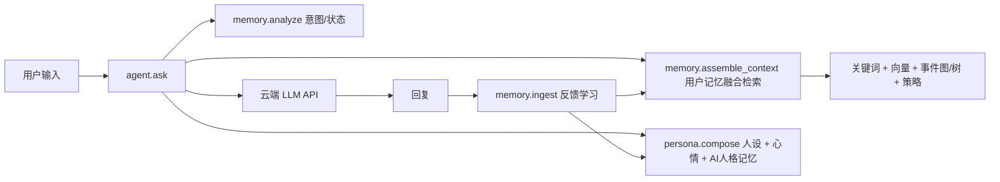

# Agent 层：Memory / Persona / Agent 系统

三层结构，全部接云端 LLM（默认 DeepSeek，`llm` 参数可换任意 OpenAI 兼容调用）：



## 用法

```python
import agent

# 完整一轮：分析 → 记忆 → 人格 → LLM → 回复
reply, meta = agent.ask(
    "我最近在做 MCP 项目",
    scopes=["c2c:user1"],          # 记忆检索范围
    history=[{"role": "user", "content": "..."}],
    learn=True, learn_scope="c2c:user1", learn_key="",   # 回复后自行学习
)

# QQ 前台（bot.py）：学习交给 plugins/memory.py 的 after_chat（场景节流），
# 所以传 learn=False，避免重复入库

# 成长：巩固 AI 观点 + 修剪 + 清理
print(agent.grow())
```

## 各层职责

| 层 | 模块 | 职责 |
|---|---|---|
| Agent | `agent/core.py` | 编排 ask/learn/grow；接云端 LLM（可换 provider） |
| Persona | `agent/persona.py` | 静态人设（persona.md 同步进统一记忆库）+ 心情 + AI 人格记忆 → system prompt |
| Memory | `memory/` | 用户长期记忆、事件图/事件树、向量检索、融合评分、反馈学习 |

## 人格记忆的成长闭环

1. 每次对话由 `memory.ingest` 沉淀新事实、事件和时间线（`follows` 链）；
2. `agent.grow()` 触发巩固：LLM 把同类型旧事件总结成 belief，写入统一记忆
   （scope=`ai`，key=`belief`，可信度 0.5）；
3. 与 AI 的对话按重要度自动沉淀为 AI 自身经历（experience，可信度 0.6）；
4. `persona.compose()` 在下一轮把 experience/belief 注入 system prompt——
   于是 AI 的"人格"会随经历缓慢变化，且变化速度由巩固频率/修剪阈值控制。

## 可信度

AI 自身记忆与用户记忆同表同格式（`memories.confidence`）：persona 身份可信度 1.0、
对话经历 0.6、LLM 巩固的观点 0.5；用户纠正会下调相关记忆可信度，
低于 0.35 的记忆不注入人格。这样 AI 的"成长"带上了可解释的可信度约束。
