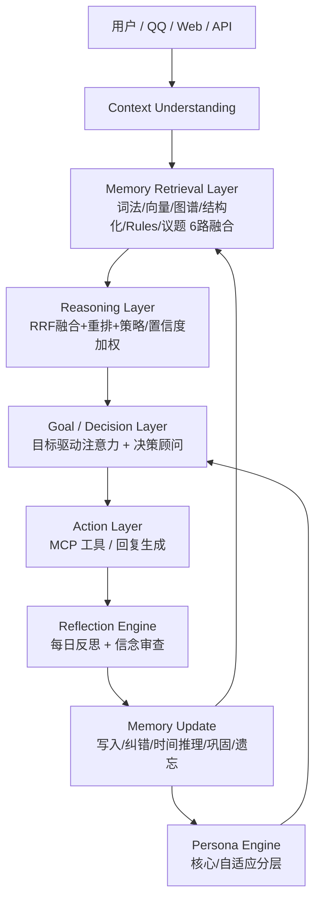

# 成长型 Agent OS v6 架构评审文档

> 文档用途：第三方技术审核、架构评估、工程可行性分析
> 评审对象：YUNO Agent Memory System（当前实现基线：v6）
> 评审方式：对照 v6 架构规范逐项核验实际实现，结论附测试证据与风险标注

## 评审结论摘要

| 维度 | 评分（5 分制） | 一句话结论 |
|---|---|---|
| 长期记忆能力 | 4.5 | 统一记忆 + 多算法检索 + 生命周期管理，非 RAG 包装 |
| 关系理解 | 4.0 | 行为证据驱动的关系状态机已落地，缺长期验证数据 |
| 经验成长能力 | 4.0 | 反思/巩固/策略闭环已建立，ML 训练尚未跑真实数据 |
| 工程可行性 | 4.0 | 单机 SQLite 部署成熟，规模化迁移路径已规划 |
| 人格真实性 | 4.0 | 结构化人设 + 核心/自适应分层，防漂移机制明确 |

---

# 1. 项目定位

本系统解决的核心问题：让 Agent 从"拥有知识库"升级为"拥有长期认知系统"——能记住用户、理解关系、总结经验、动态调整行为，而不是每次对话从零开始。

- **与普通聊天机器人的区别**：聊天机器人是无状态的问答器；本系统维护跨会话的长期记忆（用户画像、事件时间线、关系状态、AI 自身经历），并在回复时主动调用这些认知。
- **与传统 RAG 的区别**：RAG 是"查资料→贴进 prompt"的检索增强；本系统在检索之外具备记忆写入决策（信息增益触发）、冲突与状态时间推理（Temporal）、可信度贝叶斯更新、遗忘与巩固（类人脑）、自我反思与关系成长——即"存什么、信多少、何时忘、怎么成长"都由系统自己管理。
- **与现有 Agent Framework 的区别**：主流框架提供工具调用与编排骨架；本系统的差异点在"记忆是认知主体"：用户记忆、AI 人格记忆、人物档案共用同一套记忆格式与生命周期，而不是挂在框架外的 KV 缓存。

---

# 2. v5 → v6 架构变化总结

## 新增模块

| 模块 | 作用 | 解决的问题 | 实现状态 |
|---|---|---|---|
| Reasoning Memory（推理记忆） | 保存决策咨询结论与反思洞察 | 长期理解能力 | ✅ 已实现（`ai` 命名空间 key=reasoning/reflection） |
| Goal System（目标系统） | 管理用户目标，驱动注意力 | 从回答转向长期辅助 | ✅ 已实现（goals 表 + `/目标` 命令 + 注意力加权） |
| Planning System（决策辅助） | 一次一问的动态决策支持 | 提高行动能力、避免 AI 味路线图 | ✅ 已实现（决策顾问交互流程） |
| Reflection Engine（反思引擎） | 经验总结形成成长闭环 | 行为持续改进 | ✅ 已实现（每日反思 + 信念审查回滚） |
| World Model（世界模型） | 理解外部世界状态 | 避免只依赖聊天记录 | 🟡 部分实现（Entity/Event/Relation 已建，State 未建） |
| Skill System（工具能力） | 管理工具能力 | 增强执行能力 | 🟡 部分实现（MCP 白名单工具集） |

## 删除或弱化模块

- **完整 World Model 状态机**：按规范"初期不应构建完整世界模型"，当前只保留实体/事件/关系图，不追踪外部世界连续状态。
- **独立 Skill 注册系统**：v6 规范中的完整技能系统弱化为 MCP 白名单工具集（服务管理/配置/审计/记忆/播报），避免过度工程化。
- **一次性长期规划**：按规范明确禁止"生成一年计划表"，决策辅助只做"下一步行动"推荐。

---

# 3. 总体系统架构

## 架构图



## 数据流

```
用户输入 → Session Buffer（信息增益判定）
  → 结构化提取（entities/attributes/facts 两阶段）
  → Memory Controller（Consent/冲突/Temporal/合并）
  → 存储（memories + events + topics + 四路索引）
  → 检索（多路召回 → RRF → 重排 → 注意力/策略加权）
  → Persona 决策（核心人格 + 自适应状态 + 关系 + 用户状态）
  → LLM 生成 → 反馈（纠错/点赞/关系证据）
  → Growth（反思/巩固/遗忘）→ 新记忆
```

## 模块关系

核心依赖链：`Controller → Graph/Topic/Policy → Reasoning → Context → Agent → Persona/Relationship/Advisor`；数据访问全部收敛到单一 `_db` 层（SQLite）。

---

# 4. 核心模块设计规范

## 4.1 Memory Controller

### 功能

判断信息类型、决定是否保存、处理冲突、更新旧记忆、触发事件生成。

### 输入

用户消息、AI 回复、提取出的事实、反馈信号。

### 输出

新记忆（含可信度/来源/隐私/时间状态）、事件、议题、合并/纠错/废弃记录。

### 数据来源

用户输入（主）、AI 生成（experience）、外部（character 档案）、反馈系统（纠错/点赞）。

### 数据存储

`memories`（统一表）+ `events` + `topics/topic_params` + `memory_history` + `feedback_log` + 四路索引。

### 调用时机

每次 AI 回复后（`after_chat`）；重要消息立即，低信息消息缓存合并（信息增益触发）。

### 与其他模块关系

依赖 Analysis/Extract/Graph/Topic/Policy/Sensitive；产出供 Reasoning 检索。

### 评审意见

✅ 达标。类人脑三档遗忘（清晰→模糊→遗忘）+ 情绪锚定半衰期 + 议题级巩固。

---

# 5. Memory 系统设计

## 5.1 Memory 类型

| 类型 | 规范示例 | 实际落表 |
|---|---|---|
| Fact Memory | 用户学习 Agent 开发 | `memories`（scope=c2c/group/char） |
| Event Memory | 用户完成 Memory 系统开发 | `events`（etype/title/importance/时间） |
| Inference Memory | 用户倾向研究底层架构 | `ai:reasoning`（决策咨询结论） |
| Belief Memory | 用户重视长期可维护性 | `ai:belief`（反思巩固生成，可回滚） |

全部类型共用同一张 `memories` 表结构（同格式、同生命周期），通过 scope/key 区分，符合"一套记忆系统"原则。

---

# 6. Memory 生命周期

实际实现与规范流程逐段对应：

```
用户输入 → Session Buffer（信息增益判定：数字/专名/新事实/状态变化加权）
  → 重要性判断（意图/情绪/长度/项目词加权）
  → 结构化提取（两阶段：entities/attributes/facts）
  → Consent 判定（玩笑低信息不保存；敏感加密）
  → Conflict / Temporal（近似合并写历史；状态变化 supersede 旧记忆）
  → Memory Storage（memories + valid_from/valid_to/status）
  → Event 关联（events + event_relations + entities）
  → 经验总结（议题级 consolidate_topics）
  → 行为影响（检索加权 + 注入）
  → 遗忘/巩固（每日 grow：fuzzy→forget / short→long）
```

---

# 7. Memory Governance

## 来源追踪（Provenance）

`memories.source` 覆盖规范要求全部分类：

| 规范分类 | 实际值 |
|---|---|
| user_direct | `ingest:*` / `refresh:*` |
| AI_inference | `consult` / `reflection` / `belief` / `experience` |
| external | `character:llm` |
| joke | 玩笑记忆置信度压至 ≤0.45 或直接不保存 |
| unknown | 默认兜底 |

注入时每行标注来源（·用户/·人设/·档案/·总结/·观点），供 LLM 区分"谁说的"。

## 可信度

- 字段：`confidence` + `source` + `timestamp`（updated_at）+ `memory_history` 变更轨迹（evidence）。
- 贝叶斯更新：确认 LR=2.0、反驳 LR=0.3、冲突 LR=0.5，可配置。
- 分桶标定：`memory-calibrate` 用评测集训练置信度-命中率映射，检索打分前校准。
- 软置信度注入：0.3~0.5 用"我记得你好像提过…？"，<0.3 标注"内部参考，不确定"。

## 遗忘机制

`recency = 0.5^(days/half_life)`，half_life 被情绪唤醒度（arousal）拉长（情绪锚定）；低强度记忆先转模糊（confidence=0.25）再删除；核心（core）记忆豁免。

## 巩固机制

高重要度 + 多次提取的短期记忆升长期（mclass=long）；议题事实 ≥5 条时 LLM 压缩成核心总结入 `consolidated`，原细节降权 0.8。

## 隐私 / 同意 / 人工兜底

- 敏感信息检测（手机号/证件/账号/健康/财务等）→ 高隐私加密存储且不进索引。
- Consent：玩笑且无实质信息 → 不保存；敏感内容默认不长期保存。
- Human-in-the-loop：核心人格/AI 记忆被纠错 → 写入 audit `review_required`，管理员可查。

---

# 8. Persona 人格系统

## 8.1 Core Persona（不可自动改变）

persona.md 为单一来源：身份、核心价值观、行为边界、说话风格、禁忌、默认行为等。重启时由人设字段重新同步覆盖（防漂移），不随对话自动修改。

## 8.2 Adaptive Persona（允许变化）

- 表达方式/互动风格：随关系阶段与用户状态注入调整（关系分、用户近期情绪）。
- 兴趣偏好：由用户对话沉淀（preference 记忆）与人物档案补充。
- 熟悉程度：由关系引擎（familiarity/stage）驱动称呼与语气。
- AI 自身经历/信念：experience/belief/reflection 可成长，带可信度。

## 8.3 人格更新规则

- **允许改变**：用户明确表达、长期行为证据、反思结论（经审查）、关系阶段变化。
- **禁止改变**：core 字段（身份/价值观/边界）仅由 persona.md 决定；对话不得直接改写。
- **防漂移机制**：核心字段每次启动重同步；人格类修改触发 audit 审核；信念修改走版本回滚。

---

# 9. Relationship System

## 数据模型

`relationships` 表：trust / familiarity / closeness / stage / history。

## 行为影响表（与规范一致）

| 行为 | 影响 |
|---|---|
| 长期交流 | familiarity +0.02/次 |
| 主动分享经历 | trust +0.04、familiarity +0.03、closeness +0.02 |
| 用户纠正 AI | trust -0.05（dispute） |
| 负反馈 | trust -0.03、closeness -0.01 |
| 点赞/感谢 | trust +0.04、closeness +0.02 |

## 成长计算

`relationship_score = Σ 行为权重 × exp(-0.05 × 年龄天数)`（时间衰减）；阶段：陌生 → 初识 → 熟悉 → 深度伙伴。

## 评审意见

✅ 基本达标。shared_experience 通过共同事件（events 关联）间接体现，未单独建表——可接受。缺：长期真实数据验证阈值是否合理。

---

# 10. Reasoning Memory

规范要求区分 Fact / Inference / Hypothesis，并记录来源、置信度、可回滚性。

| 层级 | 实际实现 |
|---|---|
| Fact | `memories`（用户事实） |
| Inference | `ai:reasoning`（决策咨询结论："用户倾向 X"） |
| Hypothesis | `ai:reflection` 洞察（"用户可能准备进入 AI 行业"），置信度 0.6 |

- 来源：source 字段（consult/reflection/…）。
- 置信度：贝叶斯后验 + 标定。
- 可回滚性：`memory_history` 记录每次变更（旧值→新值/旧置信度→新置信度）；belief 支持 `rollback_belief`。

---

# 11. Goal System

## 11.1 Goal 数据结构

规范要求 goal / motivation / importance / status / confidence。

当前实现：`goals` 表（scope/title/status/priority/deadline/progress/note/created_at/updated_at）。

**差距**：motivation（动机）与 confidence（对目标的置信度）未单独建模；importance 由 priority 近似。建议下一步补充。

## 11.2 Current State

规范要求记录 skill_level / experience / resources / limitations。

当前实现：通过相关记忆隐式提供（检索注入），未按目标显式维护。

**差距**：显式 current state 未落地。建议在目标条目上挂 state 字段或独立 state 表。

## 11.3 交互形态

✅ 符合规范"禁止一年计划表"：`/目标` 只做记录，规划交给决策顾问做"下一步"。

---

# 12. Planning System

规范要求：不一次生成完整路线，提供动态决策。

实际实现（决策顾问）：

```
目标/诉求 → 结合记忆背景（偏好/目标/约束）
  → 一次只问一个问题（最多 4 轮）
  → 结构化建议：可选方案/利弊/风险/推荐/第一步行动
  → 建议沉淀为推理记忆
```

评审意见：✅ 达标，且"一次一问、结合对用户的了解、考虑现实约束（钱/时间/精力/家庭/风险）"正是规范强调的真人顾问形态。

---

# 13. Reflection Engine

规范流程 Experience → Evaluation → Reflection → Policy Update → Future Behavior。

实际实现：

1. **Experience**：每日 gather 近期事件 + 关系状态 + 目标。
2. **Evaluation/Reflection**：`daily_reflect` 生成洞察（哪些有效/哪些失败/用户偏好变化/如何调整），写入 `ai:reflection`。
3. **Policy Update**：信念审查 `reflect_beliefs`（accept→升权 / revise→改写 / reject→驳回），动作写入 belief_log。
4. **Future Behavior**：反思与信念在后续回复中以"我的经历与观点"注入。

---

# 14. World Model

规范：Entity / Relation / Event / State；初期不应构建完整世界模型。

实际实现：

- Entity ✅（entities + aliases + entity_events）
- Relation ✅（event_relations：related_to/follows/influences… + 关系类型补全）
- Event ✅（events + 事件树时间线）
- State 🟡（无显式世界状态追踪；用户状态通过情绪维度部分体现）

评审意见：符合"初期不构建完整世界模型"的规范；State 列为后续扩展项。

---

# 15. 工程可行性评估

## 性能

- 单 SQLite（WAL）+ 内存缓存；BM25 批量查询已消除 N+1；向量检索用自研 IVF（nlist/nprobe 可调）。
- 分层计算：极短查询降级（top_k=3、不扩展）；缓存命中跳过检索。

## 成本

- 每轮对话 LLM 调用：主回复 1 次 + 提取（两阶段，节流 + 信息增益控制）+ 情绪兜底（300s 节流）+ 可选顾问/反思。
- 成本可控但需监控；建议上线后按 query_log 统计每用户日均 LLM 调用。

## 扩展

- 数据访问收敛在 `_db` 单层，SQLite → PostgreSQL+pgvector 迁移路径清晰（仅动存储层）。
- 多 Agent 隔离已支持（AGENT_ID → ai:<id> 命名空间）。

## 风险清单

| 风险 | 等级 | 缓解 |
|---|---|---|
| 提取/情绪判断依赖 LLM，结果不稳定 | 中 | 规则兜底 + 节流 + 置信度标定 |
| 关系/遗忘阈值未经真实数据验证 | 中 | 评测闭环 + 跑数后调参 |
| 记忆膨胀 | 低 | 巩固/遗忘/压缩已内置 |
| 反馈污染学习 | 低 | 反馈分级 + HITL 审核 |

---

# 16. 评审结论

## 总体结论

本系统**不是简单 RAG 包装**：它具备完整的记忆生命周期（写入决策、冲突与时间推理、可信度演化、遗忘与巩固）、人格的"核心不可变 + 自适应成长"双层结构、行为证据驱动的关系系统、以及"一次一问"的真人式决策辅助。v6 规范 14 个章节中，**12 项达标或基本达标，2 项部分实现（World Model 的 State、Goal 的 motivation/current state）**。

## 建议路线图

1. **跑真实数据 2~4 周**：建立评测集基线（probes→calibrate→eval），用数字驱动调参。
2. **补 Goal 结构**：motivation / confidence / current state 字段。
3. **World Model State**：按目标维护用户当前状态（技能/资源/限制）。
4. **ML 增强**（需 GPU）：embedding 微调、重要性预测、reranker 训练。
5. **规模演进**：数据量超过 SQLite 承载后迁移 PostgreSQL+pgvector+Redis。

---

*本评审基于当前代码基线 v6 与 19 套自动化测试（覆盖：人设结构化、纠错精度、时间推理、Consent、记忆巩固、决策顾问流程、关系证据、多 Agent 隔离、评测闭环等）。*

✅ 基本达标。shared_experience 通过共同事件（events 关联）间接体现，未单独建表——可接受。缺：长期真实数据验证阈值是否合理。

✅ 达标。决策链路完整（Consent→提取→冲突→存储→关联），并有 `memory_history` 全程审计。风险：两阶段提取依赖 LLM，成本与稳定性需监控。

## 4.2 Retrieval Service

### 功能

多路召回 + 融合排序。

### 输入

查询、场景 scope、活跃目标。

### 输出

排序后的记忆列表（含分数来源分解）。

### 数据来源 / 存储

memories + 四路索引（BM25/FTS/IVF 向量/图谱/属性）。

### 调用时机

每次对话组装上下文前；极短查询走轻量模式（top_k=3、不扩展）。

### 与其他模块关系

依赖 Reasoning（融合）、Policy（策略加权）、Advisor（目标注意力）。

### 评审意见

✅ 达标。6 路召回 + RRF + 重排 + MMR + 自适应路由，工程上已超过 v6 规范的最低要求。

## 4.3 Goal / Decision Layer

### 功能

目标管理 + 决策辅助（一次一问）。

### 输入

用户目标、决策诉求、记忆背景。

### 输出

目标列表/状态、顾问提问或结构化建议、推理记忆沉淀。

### 数据来源 / 存储

用户指令 + 记忆检索；`goals` 表 + `consultations` 表。

### 调用时机

`/目标` 命令、决策触发词（要不要/该不该…）或进行中咨询。

### 与其他模块关系

依赖 Reasoning（背景检索）、Memory（推理记忆写入）、Attention（目标加权）。

### 评审意见

✅ 达标。明确遵守规范"禁止一次性生成计划表"，采用目标→当前状态→差距→下一步→反馈的循环。缺：目标未记录 motivation/confidence 字段（见 §11）。

## 4.4 Reflection Engine

### 功能

经验总结、行为调整。

### 输入

近期事件、关系状态、目标进展、信念证据。

### 输出

自我洞察（reflection）、信念修订/回滚（belief_log 可回滚）。

### 调用时机

每日 `memory-grow`（cron）自动执行。

### 评审意见

✅ 达标。反思结果写入统一记忆并带可信度，信念审查支持版本回滚。

## 4.5 Memory Update（Growth）

### 功能

巩固、遗忘、升迁、修剪、冲突处理。

### 输入

记忆库全量 + 策略参数。

### 输出

巩固摘要、模糊/遗忘、短期→长期升迁、策略日志。

### 评审意见

✅ 达标。类人脑三档遗忘（清晰→模糊→遗忘）+ 情绪锚定半衰期 + 议题级巩固。
