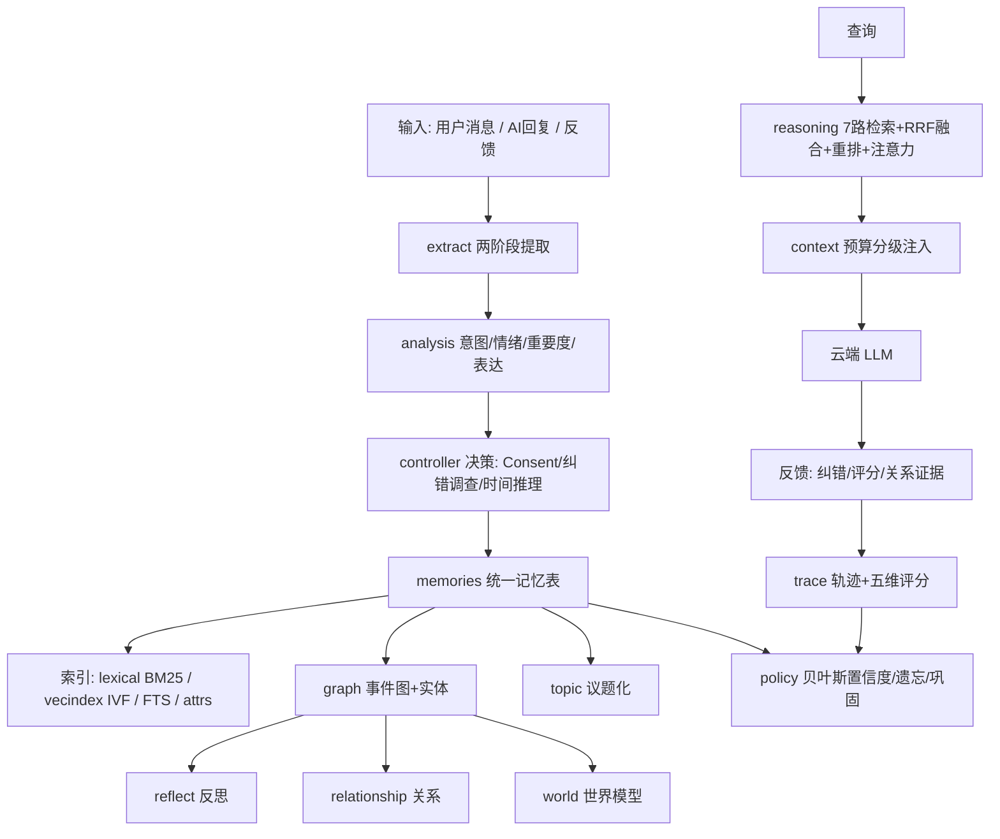

# memory/ —— 统一记忆系统（Memory Core）

> 让 Agent 从"拥有知识库"升级为"拥有长期认知系统"。记忆不是聊天记录，而是
> 有**可信度演化、时间推理、遗忘巩固、纠错调查、人格与关系**的认知主体。

## 1. 框架总览



## 2. 数据模型（SQLite 单库 data/bot.db）

核心是统一 `memories` 表：用户（`c2c:<uid>` / `group:<gid>` / `group_all:<gid>`）、
AI 自身（`ai` / `ai:<id>`）、人物档案（`char:<名>`）**同表同格式**。

| 表 | 作用 |
|---|---|
| `memories` | 唯一事实记忆：confidence/source/audience/privacy/valid_from/valid_to/status/embedding |
| `memory_meta` | 访问计数/最后访问（遗忘与巩固的输入） |
| `memory_attrs` | 结构化属性（偏好/家庭/健康…） |
| `events` / `event_relations` | 事件图：类型→事件→元素→关系/时间线 |
| `entities` / `entity_aliases` / `entity_events` | 实体归一与事件挂实体 |
| `topics` / `topic_params` | 议题化：大类→议题→参数（fact/mood/playful…） |
| `sessions` | 会话窗口+主题 |
| `goals` / `consultations` | 目标 / 决策咨询会话 |
| `relationships` | AI-用户关系状态机 |
| `feedback_log` / `memory_history` / `policy_log` | 反馈分级 / 记忆变更审计 / 策略日志 |
| `memory_trace` / `trace_review` | 记忆处理轨迹 / 五维人工评分 |
| `query_log` / `kv` | 查询遥测 / 标定·路由·baseline |
| `language_context` / `user_expression_profile` | 网络词候选池 / 用户表达画像 |

派生索引（`bm25_*` / `vec_index` / `memories_fts`）不参与导出，由 grow 重建。

数据层工程化（v2.3 工程轮）：

- **写事务**：`_db.transaction()` 上下文管理器——事务内所有 helper 的提交点挂起，
  `controller.ingest` 主写段（合并/替换/事件图/议题/词法/多主体/巩固/关系）单事务原子写，
  中途失败整体回滚，不留"事实已存但图/索引/议题缺失"的半成品；嵌套安全。
- **检索下推**：`_db.memory_rows_by_facts(scope, facts)` 把 `WHERE fact IN (...)` 下推 SQL，
  `reasoning._retrieve_single` 不再全表拉取后 Python 过滤；隐式反馈改 `meta_touch_many`
  批量提交（一次事务 vs 逐条 commit）。
- **公共助手**：`plugins._shared.core_cfg(section, key, default)` 统一配置读取（各模块
  `_cfg` 转发）；`memory/_llmutil.parse_json_object` 统一 LLM JSON 提取（9 处收敛）；
  `emotion.vad_centroid` 统一 VAD 加权质心（议题质心与用户情绪估计共用，逐位等价）。
- **观测**：`llm_cost_clear()` 清空成本表（测试隔离/运维重置）。

## 3. 一条消息的完整旅程

```
用户消息
 → expression 语言语义层（网络词/玩笑概率/表达画像）
 → analysis 意图/情绪/重要度 + LLM 情绪兜底（节流）
 → controller.message_gain 信息增益评分（数字/专名/新事实/状态变化）
   低信息 → 缓存合并；高信息/纠错 → 立即处理
 → Consent：玩笑低信息不存、临时情绪不存、敏感加密
 → Temporal：状态变化（转/换/改用+专名）→ 旧记忆 superseded
 → 纠错调查：LLM（节流）判断 update/keep/uncertain
 → 两阶段提取（entities/attributes/facts）+ 无信息陈述过滤
 → 相似合并（merge 记历史）→ 存 memories + embedding
 → 事件图建边 + 议题化 + 四路索引同步 + 策略 touch
 → 关系证据更新 + 表达画像更新 + 轨迹记录
 → （检索时）7 路召回 → RRF → 重排 → 软置信度 → 预算注入 → LLM
 → （每日 grow）反思/巩固/遗忘/评测
```

## 4. 模块详解

### extract —— 提取与文本处理

- **作用**：从对话提取值得记住的事实；中文分词；查询理解。
- **算法**：两阶段提取——第一阶段 LLM 结构化抽取（entities/attributes/facts，不总结只提取、
  保留名字/数字/品种、禁止"X是人"无信息陈述）；第二阶段转成长期记忆事实；失败回退单段提取。
  分词优先 jieba，未装则中文相邻二元组（已修复 6 字截断 bug）。
  查询理解含指代消解（"那个项目"→前文实体）、同义扩展、**短查询前文补全**（错别字容错）。
- **为什么**：单段摘要会丢细节（"橘猫"变"狗"），结构化抽取 + 过滤能保真。

### analysis —— 状态分析

- **作用**：意图（求助/偏好/事件/回忆/情绪）、情绪、重要度、纠错信号、玩笑概率。
- **算法**：规则词表为快路径；规则判"平静且非玩笑"时节流调 LLM 兜底情绪；
  历史融合情绪（近 3 条 ≥2 消极 → 低落）只影响语气，不触发临时情绪拒绝。
- **为什么**：规则零成本覆盖常见场景，LLM 兜底补长尾，历史融合补"连续失败后该耐心"。

### controller —— 记忆控制器（决策核心）

- **作用**：决定是否保存、处理冲突、时间推理、合并更新、AI 经历沉淀。
- **算法**：
  - `message_gain` 信息增益评分 = 数字(+0.25) + 专名(+0.2，含中文人名/地名/项目实体) + 新颖度(+0.45×(1−重叠)) + 状态变化(+0.3)，替代固定 10 分钟节流
  - Consent：玩笑且低信息 → 不保存；文本规则情绪且无载体 → 不保存；敏感 → 加密
  - `_supersede_old` 时间推理：状态词 + 新旧都有专名 → 旧记忆 superseded（保留历史）
  - `_decay_conflicts` 纠错调查：特征词匹配 → 受限 LLM 判断 update（废弃）/ keep（保留）/ uncertain（降权+contested）
- **为什么**：让"存什么、改不改"成为可解释决策，而不是硬编码规则或 LLM 直接覆盖。

### graph / topic —— 事件图与议题化

- **事件图**：每个事实建事件，按语义相似建 related_to 边、按时间建 follows 边（事件树）；
  实体归一（canonical+别名），事件挂实体。支撑"为什么相关"的图谱召回与时间线。
- **议题化**：大类（规划/学习/项目/偏好…）→ 议题（实体+类别；无实体用"类别·摘要"语义聚类）→
  参数（fact/mood/playful/可信度）。检索时按议题打包注入。

### lexical / vecindex —— 检索通道

- **BM25**（真分词倒排，k1=1.5, b=0.75）：专名/数字的主通道；FTS5 trigram 兜底；LIKE 最后降级。
- **IVF 向量索引**（自研）：bge-large-zh-v1.5（1024 维）→ kmeans 质心 → nprobe 探测打分；
  `memory-index --tune` 网格调 nlist/nprobe；nlist=0 / nprobe=0 时自动按 √n 缩放（v31）。
- **规则直查**：结构化属性问题（"喜欢什么"→preference）确定性命中。

### reasoning —— 融合推理

- **算法**：6 路候选（词法/向量/图谱/结构化/Rules/议题）→ RRF 融合（权重可配）→
  策略/置信度乘性微调（v31：相关度优先——重要度×时效与置信度只做 ×(1+…) 微调，不再加性主导排序）→
  软过滤（min_score×0.6，低分降权不剔除）→ 重排（light/cross/LLM 三档）→ MMR 多样性。
  附加：查询时间窗加权（"最近"降旧记忆）、活跃目标注意力（×1.08）、
  超预算注入压缩（最多 8 条 + "等 N 条"）。
- **为什么**：单一通道都会漏，融合 + 可解释分数分解（rrf/policy/confidence）才能既召回又可控。

### policy / bayes —— 学习与可信度

- **贝叶斯置信度**：`后验 odds = 先验 odds × 似然比`；确认 LR=2.0、反驳 0.3、冲突 0.5（可配）。
  按事实类型加阻力（v22）：稳定事实（生日/血型/身份）×3、主观偏好 ×2，有效
  `LR' = 1 + (LR−1)/阻力`（v31：确认证据不受阻力稀释，阻力只用于反驳/冲突）——玩笑与单次轻纠错难撼动高可信锚点，多次强证据仍能翻转；
  玩笑语境（joke≥0.5）与非强纠错的"其实…"不攻击稳定事实。
- **遗忘曲线**：`recency = 0.5^(天数/半衰期)`，半衰期被情绪唤醒度拉长（情绪锚定），
  再按用户活跃密度缩放（v22）：近 7 天活跃度高于 4 条/天 → 半衰期最多 ×3（记得牢），
  稀疏交流 → ×0.3（琐碎记忆快速淡出）；AI 自身记忆不受影响。
  类别化（v31）：core 永不忘（只随证据更新）；stable（生日/血型/身份）≈720 天、
  preference ≈360 天、long ≈240 天、process 回退默认、short ≈60 天、dream（梦）≈1.5 天；
  稳定事实与偏好只降模糊（conf=0.25）不硬删除。
  三档遗忘：清晰 → 模糊（conf=0.25）→ 删除；核心记忆豁免。
- **巩固**：高重要度+多次提取 → 短期升长期；议题事实 ≥5 条 → LLM 结构化压缩
  （核心总结 + 时长/诱因/情绪转折/结果/偏好属性，v22 情绪价值修复），原细节降权保留；
  LLM 失败回退为过程链（A → B → C），不把心理变化压成一句空话。
- **标定**：分桶映射（评测集命中率），评分驱动 confidence_factor 防过度自信。

### context —— 上下文组装

- 令牌预算分级注入：议题（核心）→ 记忆 → 事件脉络，逐级填充到 `context_budget_chars`（默认 2000）。
- 软置信度措辞：0.3~0.5 "我记得你好像提过…？"、<0.3 "（内部参考，不确定）"；
  contested 加"（待核实）"；来源标注（·用户/·人设/·档案/·总结/·观点）。
- 防编造约束：只能引用记忆内容回答个人问题，禁止编造细节。

### reflect / relationship / advisor / world / expression / trace

- **reflect**：每日反思（事件/关系/目标 → 洞察入 ai:reflection）+ 信念审查（accept/revise/reject，可回滚）。
- **appointment**：约定管理（v23）——识别「明天下午3点见 / 后天早上碰头」入 kv（按用户时区），
  约定时间 + 宽限期已过且用户没出现时主动催（最多 2 次、情绪递增：平淡带刺 → 担心嘴硬），
  待履约约定会注入上下文让 AI 自然记得。
- **mistake**：错误与原谅引擎（v23）——同类错误按类别计数，生气度 = 次数封顶 3 × 0.5^(天/7)
  （第二次生气、第三次习以为常、随时间释然）；底线类（撒谎/欺骗/越界）不道歉松口概率为 0，
  道歉后按 关系分/信任/熟悉度 + 冷静程度 计算松口概率并随机判定；类似场景注入态度提示。
- **relationship**：AI-用户关系状态机，行为证据（chat/share/praise/dispute/negative）驱动
  trust/familiarity/closeness，`关系分 = Σ 行为权重 × exp(-0.05×天数)`，阶段 陌生→初识→熟悉→深度伙伴。
- **advisor**：目标系统（motivation/confidence/current_state/paused）+ 决策顾问
  （一次一问、结合记忆、现实约束、去模板化、防夸张）。
- **world**：用户中心世界模型——只跟踪用户提到的内容，快照硬预算 400 字符 + 缓存，
  纠正调查（update/keep/uncertain）不盲从。
- **expression**：语言语义层——50+ 网络词多义意图、玩笑概率、表达画像
  （slang/irony/emoji/formal，驱动表达适配）。
- **emotion**：多维情绪模型（v31）——Russell 环形（效价/唤醒 2D）+ VAD（支配度 3D）+
  Plutchik 8 基本情绪 × 强度档；AI 情绪状态机（人设基线 + 消息事件增量 + 指数衰减，
  kv 持久化重启不丢）；用户情绪滚动窗口 + 效价趋势，注入 prompt 调整语气。
- **sleep**：睡眠与梦境（v31）——浅睡（短期→长期升迁）+ 深睡（当天对话巩固成
  ai:recall"今日回忆"）+ REM（DeepSeek 生成梦：类型/内容/逻辑性随机，随机抽记忆+
  人设元素；防 AI 味词过滤——文学腔/舞台提示/总结升华一律判不合格回退模板拼装；
  梦内容大概率忘记，小概率留模糊 dream 记忆，1.5 天半衰期）；清晨主动提一次，
  用户追问时按记忆状态回应（模模糊糊 / 完全陌生）。睡眠模式（v31.1）：睡眠=拟人化
  节能待机（不是失联）——待机档被消息唤醒=被从省电里捞出来，半醒分层回应；
  深睡档（默认凌晨 2~5 点）真离线，消息进未读队列，醒来自然带一句"你昨晚找我了？"；
  连续紧急消息触发系统级紧急唤醒；被打断次数进今日回忆（"昨晚被吵醒 N 次没睡好"）。
- **schedule**：AI 日程表（v31）——活动注册表（工作/学习/宅家休息/宅家娱乐/外出娱乐/
  运动/和朋友玩/排练/演出/作曲/打碟）+ 人设档案（上班族天天上班；千石由乃夜行、排练/
  演出/宅家为主）+ 种子化周生成（同一周稳定、下周变化，演出前合练/演出后恢复等状态链）；
  运行时按当前时间注入"此刻状态"（内部参考）；用户约定优先于默认日程。
- **weather**：天气提供方（v31）——和风/高德 API 直连（kv 缓存），失败回退按季节种子的
  模拟天气；输出温度/天气/风/光照描述，供环境感知快照使用。
- **environment**：环境感知（v31）——日程活动 → 地点 → 周围人物（队友/朋友/路人/观众）→
  天气/光照/风；快照按"日期+槽位"缓存保持稳定；提及规则：用户认识的人可详述、不认识的带过。
- **sharing**：分享欲 + 自动发消息（v31）——事件增量（演出/作曲/梦/被夸）+ 情绪 VAD 加成 +
  指数衰减 + 关系门槛；触发后组装日程/环境/心情上下文，LLM 生成人设消息走通知队列主动发给
  用户；反骚扰：冷却 3h、日上限 2、周上限 8、演出/睡觉时段静默。
- **living**：生活环境层（v31）——家的布局（房间→家具→容器）+ 物品表（懒展开：箱子里
  有什么查询时才注入）+ 拿/用/送/移动操作（数量增减、写记忆、联动分享欲）+ 动态距离感
  （基准分钟 × 交通方式 × 天气 × 由乃懒系数 × 情绪 × 当日种子抖动）；每日 grow 跑生活
  演化 tick；状态全部 kv 持久化，重启不丢（情绪/分享/环境/日程同理）。
- **space**：空间层（v31）——统一位置事实源（schedule/environment/living 都从它读位置，
  消除表述不一致）；位置状态机（在场/在途中，出发窗口=槽位开始-路程，自动出发/到达）；
  场所拓扑（任意两点路程，pair_times 可配）；空间事件流（出发/到达/人物进出/物品移动，
  sharing/sleep 消费）；视觉一致性（房间静态描述 + can_see：同房间 + 光线，夜里看不清）。
- **interaction**：互动调节层（v31）——统一公式"有效值 = 基准 × 场景 × 关系 × 用户状态 ×
  频率"；场景（群里少打扰/正式更重要）、关系（陌生0.5~深度1.2，熟悉度 30 天半衰期衰减）、
  用户状态（低落少打扰多关心/深夜/潜水）、频率（同类事件 0.8^(k-1) 刺激适应）；
  sharing/relationship/mistake/appointment/emotion/advisor/sleep 全部接入。
- **trace**：记忆处理轨迹（create/merge/update/decay/reject/relationship/inject + 原因），
  五维人工评分（提取/决策/置信度/来源/隐私）驱动行为参数（confidence_factor/igt/privacy 阈值）。

### sensitive / character / embedder / update / backfill / eval

- **sensitive**：敏感检测（手机号/证件/账号/健康/财务…）+ 可选 AES-GCM 加密，检索过滤。
- **character**：`/设定 角色` 生成人物档案入 `char:<名>`，查询提到角色时自动注入；
  同时双写 `docs/characters/<名>.md`（新角色卡模板结构）供人工审阅/编辑，
  改完运行 `tools.py character-sync <名>` 一键同步回记忆库（md 为权威来源，清旧重建不堆叠）。
- **embedder**：本地 sentence-transformers 或云端 OpenAI 兼容，单例缓存。
- **update**：近似重复合并（不堆叠）、确认刷新、公开标记。
- **backfill / eval**：每日成长管线（向量回填/事件图/议题/巩固/遗忘/反思/索引重建/评测对比 baseline）；
  评测 recall@K / MRR / NDCG。

## 5. 关键算法一览

| 算法 | 公式/要点 | 用在哪 |
|---|---|---|
| 信息增益 | `score = 0.25·数字 + 0.2·专名 + 0.45·新颖度 + 0.3·状态变化`，低分缓存合并 | 决定是否提取 |
| 贝叶斯置信度 | `odds' = odds × LR`；确认2.0 / 反驳0.3 / 冲突0.5；稳定事实×3 / 偏好×2 阻力（v31：确认不受阻力稀释） | 可信度演化 |
| 遗忘曲线 | `0.5^(days/half_life)`，half_life 受 arousal 拉长、再按活跃密度 ×0.3~3 | 时效降权 |
| RRF 融合 | `Σ w/(60+rank)`，7 路加权 | 多通道排序 |
| BM25 | `idf·tf(k1+1)/(tf+k1(1-b+b·dl/avgdl))`，k1=1.5 b=0.75 | 词法主通道 |
| IVF | kmeans 质心 + nprobe 探测余弦打分 | 向量检索 |
| MMR | `λ·相关 − (1−λ)·最大相似`，λ=0.7 | 多样性去重 |
| 软置信度 | `min_score×0.6` 保留低分 + 注入端分档措辞 | 不硬删除 |
| 关系分 | `Σ 行为权重 × exp(-0.05·天数)` | 关系成长 |

## 6. 设计决策（为什么这么做）

1. **一套记忆系统**：用户/AI/人物同表同格式，人格也是记忆，可统一检索/遗忘/评分；
   避免"记忆在 KV 里、人格在 prompt 里"的割裂。
2. **可解释优先于黑盒**：每个决策（保存/拒绝/合并/纠错）都有原因，轨迹可导出、可评分、
   可回滚——这是"工程化记忆"与"聊天记录堆"的根本区别。
3. **不盲从用户纠错**：先调查再更新，防止一句话推翻长期证据；历史永远保留。
4. **Token 预算硬约束**：快照 400 字符、调查 max_tokens=100 且节流、注入预算 2000、
   极短查询降级——认知深度不牺牲成本可控。
5. **评分驱动行为**：人工五维评分不仅存档，还实时调整 confidence_factor / 提取门槛 /
   隐私阈值，形成"评分→行为"闭环，为后续训练铺路。

## 7. 当前瓶颈

1. **提取仍依赖 LLM**：有过滤但无法 100% 保真（"林晓是人"类噪声靠 prompt+正则压，
   长尾仍会漏）；根治需提取质量门控模型（路线图 V14）。
2. **阈值未校准**：关系阶段、遗忘半衰期、表达画像阈值都是经验值，需真实数据校准。
3. **检索无数字基线**：评测管道就绪但 probes/评分还在积累，权重调整暂无数字依据。
4. **单 SQLite + 内存态**：`_chat_busy` / 缓存 / 节流状态重启即失；大流量需评估迁移
   PostgreSQL+pgvector（数据层已收敛在 `_db`，迁移路径清晰）。写入已事务化，半成品
   状态已消除。
5. **prompt 级约束的极限**：防编造、防模板、防夸张是提示词层面，无法 100% 根除；
   彻底解决依赖 AI 味抽查集 + 训练。

## 8. 相关文档

训练与调优、情绪判断、详细设计等规划文档与版本记录维护在仓库外的 docs 目录，不随本仓库分发。
